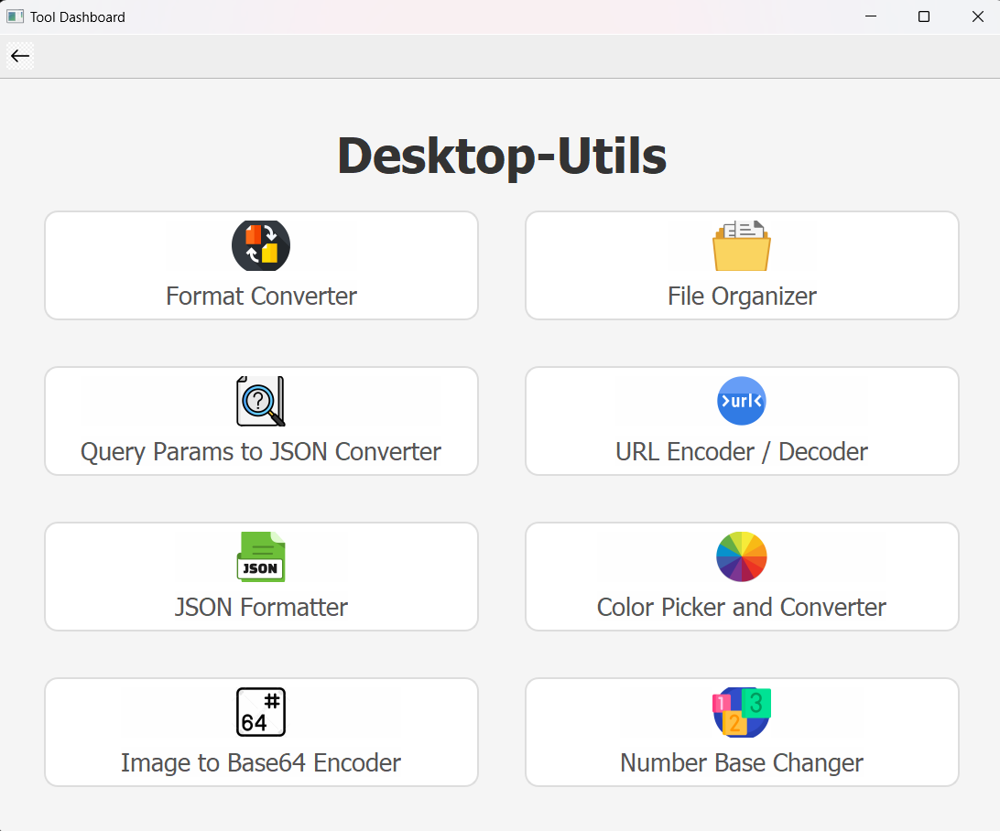
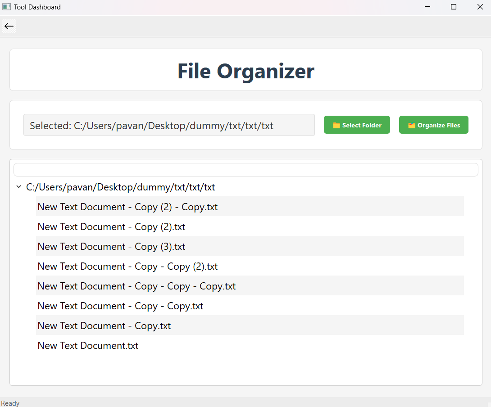
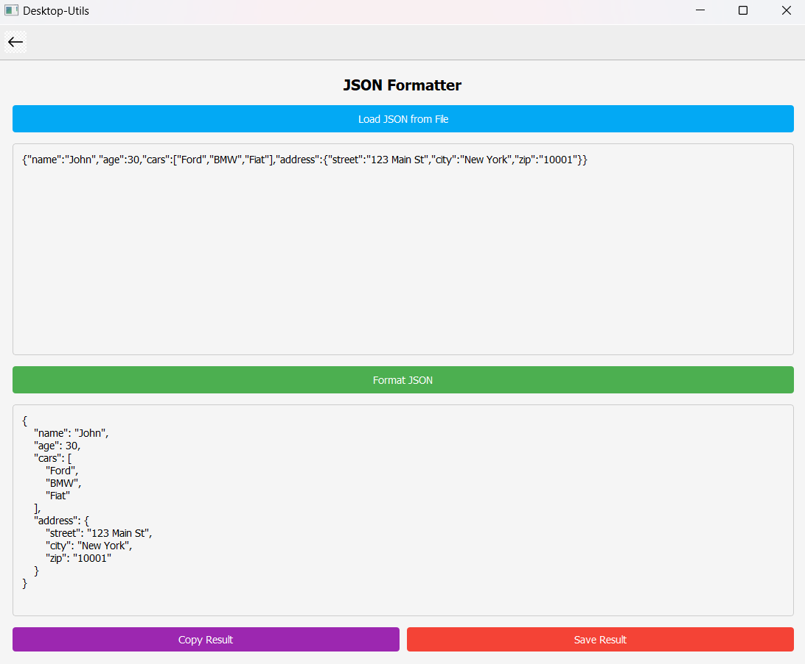

# Desktop-Utils

Desktop-Utils is a multi-tool desktop application built using PyQt5. It provides a dashboard to access several utility tools such as file organizing, JSON formatting, URL encoding/decoding, and more.

## Features

- **File Organizer:** Organize files into folders by file extension.
- **JSON Formatter:** Format and prettify JSON strings.
- **URL Encoder / Decoder:** Easily encode or decode URL parameters.
- **Query Params to JSON Converter:** Convert URL query parameters to JSON.
- **Format Converter:** Generic file conversion tool.
- **Image to Base64 Encoder:** Convert images to Base64 strings.
- **Number Base Changer:** Convert numbers between different bases.
- **Color Picker and Converter:** Pick colors and get their different formats.

## Sample Screenshots

## Sample Screenshots






## Project Structure
```
Desktop-Utils
├── apps
│ ├── file_organizer.py
│ ├── json_formatter.py
│ ├── url_encoder_decoder.py
│ ├── query_params.py
│ ├── converters.py
│ ├── image_to_base64_encoder.py
│ ├── number_base_changer.py
│ └── color_picker_converter.py
|
├── icons
│ ├── back.png
│ ├── file_organizer.png
│ ├── json_formatter.png
│ ├── number_base_changer.png
│ ├── query_params.png
│ ├── url_encoder.png
│ ├── format_converter.png
│ ├── color_picker.png
│ └── image_to_base64.png
|
├── main.py
└── README.md
```

## Prerequisites

- Python 3.x
- [PyQt5](https://pypi.org/project/PyQt5/)

You can install PyQt5 using pip:

```bash
pip install PyQt5
```

## Installation

1. Clone the repository:

```bash
git clone https://github.com/bPavan16/desktop-utils.git
```

Navigate to the project directory:

```bash
cd desktop-utils
```

2. Install the requirements (if you have a requirements.txt, otherwise just PyQt5):

```bash
pip install -r requirements.txt
```

## Usage

Run the main application using Python:

```bash
python main.py
```

3. This will launch the dashboard where you can select any of the available tools by clicking on their corresponding icons.

## Customization

- **Icons:** Custom icons are available under the icons directory. To change any icon, simply replace the existing file, or update the icon paths in the source code.
- **Styling:** The UI styling is handled using PyQt5’s `setStyleSheet` method. You can adjust the CSS values to match your desired look.
- **Extending Tools:** To add or modify a tool, update the `TOOLS` list in `main.py` and create or modify the corresponding Python file under the `apps` directory.

## Contributing

Contributions are welcome! Please fork the repository and submit a pull request with any improvements or bug fixes.

### Steps to Contribute

1. **Fork the Repository:** Click on the "Fork" button at the top right of the repository page.
2. **Clone the Forked Repository:** Clone your forked repository to your local machine.
   ```bash
   git clone https://github.com/bPavan16/desktop-utils.git
   ```
3. **Create a New Branch:** Create a new branch for your feature or bug fix.
   ```bash
   git checkout -b feature-or-bugfix-name
   ```
4. **Make Changes:** Make your changes to the codebase.
5. **Commit Changes:** Commit your changes with a descriptive commit message.
   ```bash
   git commit -m "Description of the feature or bug fix"
   ```
6. **Push Changes:** Push your changes to your forked repository.
   ```bash
   git push origin feature-or-bugfix-name
   ```
7. **Submit a Pull Request:** Go to the original repository and submit a pull request from your forked repository.

### Code of Conduct

Please adhere to the [Code of Conduct](CODE_OF_CONDUCT.md) in all your interactions with the project.

### Reporting Issues

If you encounter any issues, please report them using the GitHub issue tracker. Provide as much detail as possible to help us resolve the issue quickly.

### Feature Requests

We welcome new ideas! If you have a feature request, please open an issue and describe the feature in detail.

Thank you for contributing to Desktop-Utils!

## License

This project is licensed under the MIT License.

## Acknowledgements

- PyQt5 Documentation
- Any other libraries or resources you used in the project.
